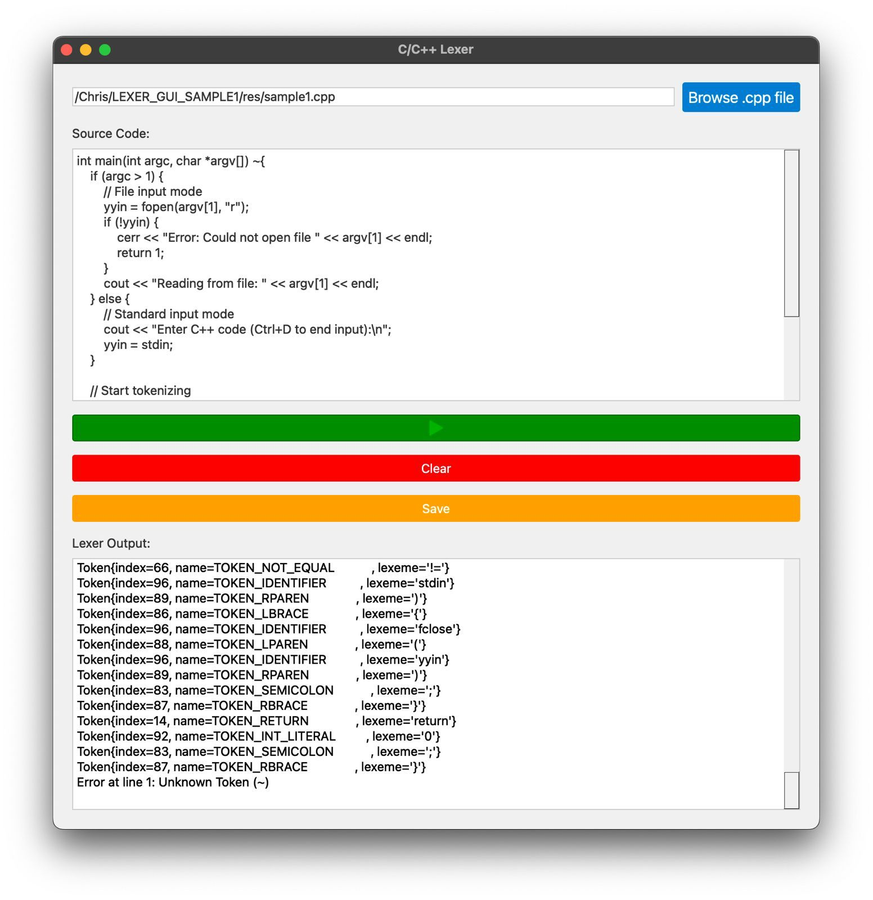

# LEXER_GUI_SAMPLE1

This project is a lexer for C++ code with a graphical user interface (GUI) built using Python and C++. The lexer tokenizes C++ source code and displays the tokens in a GUI.

## Features

- Tokenizes C++ source code
- Displays tokens in a GUI
- Supports file input and direct code input
- Provides options to run, clear, and save the code

## Requirements

- Python 3.x
- PyQt5
- C++ compiler (e.g., g++)

## Installation

1. Clone the repository:
    ```sh
    git clone https://github.com/ChristoferNVR2/LEXER_GUI_SAMPLE1.git
    cd LEXER_GUI_SAMPLE1
    ```

2. Install the required Python packages:
    ```sh
    pip install PyQt5
    ```

3. Build the C++ lexer:
    ```sh
    mkdir build
    cd build
    cmake ..
    make
    ```

## Usage

1. Run the GUI application:
    ```sh
    python gui/gui.py
    ```

2. Use the GUI to browse for a C++ file or enter C++ code directly.

3. Click the **Run** button to tokenize the code and display the tokens.

4. Use the **Clear** button to clear the input and output fields.

5. Use the **Save** button to save the entered code to a file.

## Screenshots

### Main Window


### Tokenized Output


## Project Structure

- `src/`: Contains the C++ source code for the lexer.
- `flex/`: Contains the Flex lexer definition file.
- `gui/`: Contains the Python GUI code.
- `res/`: Contains additional resources such as sample C++ files and images.
- `build/`: Directory for building the C++ lexer.

## Contributing

Contributions are welcome! Please open an issue or submit a pull request.

## License

This project is licensed under the MIT License. See the `LICENSE` file for details.